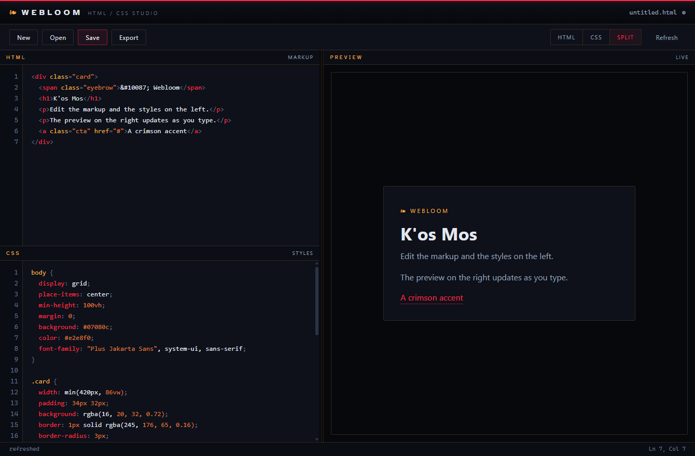

# Webloom

A WYSIWYG HTML and CSS editor with a live preview pane. Write markup and styles on the left, watch the page render on the right as you type.



A native Windows application built in Rust with [tao](https://github.com/tauri-apps/tao) and [wry](https://github.com/tauri-apps/wry) (WebView2). It ships as a single standalone `.exe` with nothing to install.

## Features

- **Split editor.** HTML and CSS panes with syntax highlighting, line numbers, and a draggable divider.
- **Live preview.** The right pane re-renders on a short debounce as you type, using the system WebView2 engine for accurate CSS.
- **Error reporting.** Script errors from the previewed page surface in the status bar instead of failing silently.
- **Native file handling.** Open, Save, and Export through real Windows dialogs. Export writes a standalone `.html`.
- **Three views.** HTML only, CSS only, or side by side.
- **Kos Mos palette.** Dark ground, a single crimson accent, gold hairlines and ornament.

## Requirements

- **To build:** Rust stable (edition 2024 needs rustc 1.85 or newer) with the MSVC toolchain, installed by Visual Studio Build Tools.
- **To run:** Windows 10 or 11. The WebView2 runtime is preinstalled on Windows 11 and ships with recent Edge on Windows 10.

## Build

```bash
cargo build --release --target x86_64-pc-windows-msvc
```

The executable lands at `target/x86_64-pc-windows-msvc/release/webloom.exe`.

`.cargo/config.toml` sets `+crt-static` for this target, so the C runtime is linked into the binary and the exe needs no VC++ Redistributable on the target machine.

## Run

```powershell
target\x86_64-pc-windows-msvc\release\webloom.exe
```

## Development

```bash
cargo run --target x86_64-pc-windows-msvc
```

Debug builds keep a console window and enable WebView2 devtools, so you can right click the page and choose Inspect.

## How it works

| Path | Role |
|---|---|
| `src/main.rs` | Native host: the tao window, the wry webview, the IPC bridge, and native file dialogs via `rfd` |
| `assets/index.html` | The entire user interface, embedded into the binary with `include_str!` |

The page talks to Rust over wry's IPC channel (`window.ipc.postMessage`). The preview is a sandboxed `<iframe>`, deliberately without `allow-same-origin` so that previewed code cannot reach the editor shell, and its `srcdoc` is recomposed on a debounce.

## Continuous integration

`.github/workflows/build.yml` builds the release executable on every push and pull request and uploads it as the `webloom-windows-x86_64` artifact. Pushing a tag that starts with `v` also publishes a GitHub Release with the exe attached:

```bash
git tag v0.1.0
git push origin v0.1.0
```

## License

Licensed under either of the following, at your option:

- Apache License, Version 2.0 ([LICENSE-APACHE](LICENSE-APACHE))
- MIT license ([LICENSE-MIT](LICENSE-MIT))
